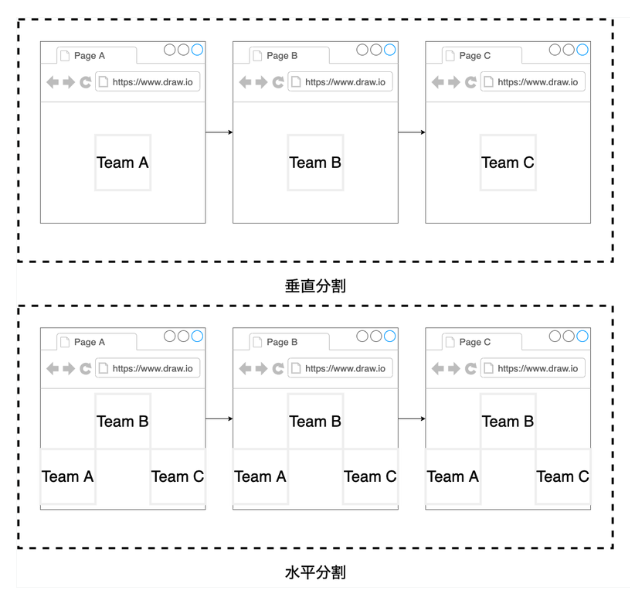

# マイクロフロントエンドって？

## 参考

- <https://intro-to-micro-frontends.netlify.app/>

## マイクロフロントエンドの原則

- 適切なドメイン毎の分離
  - コレをミスると狙った効果は生まれず、むしろボトルネックになる
  - コードが適切に分割されていて、独立して実行できるものか
- 障害の観測性・分離
  - 適切なログ
  - 障害の原因の特定のしやすさ
  - 単一障害点がないか（特定のマイクロフロントエンドが動かなくても他のマイクロフロントエンドは動作するか）
- デプロイの独立性・容易性
  - マイクロフロントエンド単体をデプロイできるか
  - CI/CD
  - 自動テスト（事マイクロフロントエンドにおいてはフロント E2E の自動化だろうか）
- 実装の隠蔽
  - インターフェイスだけの公開を原則とし、詳細を知る必要がない
- ガバナンスの分離
  - 管理体制、意思決定が単一チームで行えるか

## マイクロフロントエンドの意思決定方法と組成パターン

### 意思決定のフレームワーク

1. アーキテクチャにおけるマイクロフロントエンドの定義
2. マイクロフロントエンドの構成
3. マイクロフロントエンドのルーティング
4. マイクロフロントエンドのデータのやり取り

### 1. アーキテクチャにおけるマイクロフロントエンドの定義

ここが一番の肝。
DDD を利用して、適切に分割する。
そのためにもビジネスの仕組みを理解する必要がある。
既に動いているサービスであれば、ユーザーがアプリケーションをどのように操作しているのを収集するところからスタートすると良い。
また、既にバックエンドがマイクロサービス化しているのであれば、その単位で分けてしまうのも良い。そうすることでバックエンド〜フロントエンドまでを 1 つのチームが管理できるので、意思決定も素早くなる。

マイクロフロントエンドには以下の 2 つの定義が存在する。

- 垂直分割
  - URL 毎にフロントエンドが分かれる
- 水平分割
  - 1 つの画面の中に複数のフロントエンドが共存している
  - Amazon 等の EC サイトがイメージしやすい

### 2. マイクロフロントエンドの構成／3. マイクロフロントエンドのルーティング

どこでフロントエンドを合成するのか。ルーティングは合成箇所で行うのが一般的。

- クライアントサイド
- エッジサイド（CDN）
- サーバーサイド

### 4. マイクロフロントエンドのデータのやり取り

例えば、フロントエンド A にあるボタンがクリックされた時に、フロントエンド B に何かしらのイベントを送り、フロントエンド B のボタンを disabled にする等、フロントエンド間のイベントを参照したいケース等。
マイクロフロントエンド同士で直接イベントのやり取りをするのはアンチパターンなので、以下のような実装パターンを取る。

- 垂直分割

  - Web ストレージ
  - クエリ文字列

- 水平分割
  - イベントエミッター
  - カスタムイベント
    - Pub/Sub のような仕組み等
  - Web ストレージ
  - クエリ文字列

以上をまとめると以下の組み合わせになる

| 分割パターン | 組成パターン                                         | ルーティング                     | データのやり取り                                                         |
| ------------ | ---------------------------------------------------- | -------------------------------- | ------------------------------------------------------------------------ |
| 水平分割     | クライアントサイド サーバーサイド エッジサイド | 組成パターンと同じく             | イベントエミッター カスタムイベント Web ストレージ クエリ文字列 |
| 垂直分割     | クライアントサイ サーバーサイド                   | 組成パターンに加えてエッジサイド | Web ストレージ クエリ文字列                                           |

## 各組み合わせ毎の仕様技術

### 垂直分割 x クライアントサイド

- ES モジュール
- System JS
- モジュールフェデレーション
  - webpack5 に実装されている機能で、マイクロフロントエンド間での共通部分のチャンクを共通の JS として出力してくれる（ネットワークのオーバーヘッド等が低減できる）
- HTML パース
- フレームワーク
  - クライアントサイドだと、[single-spa](https://single-spa.js.org/) が有名

### 水平分割 x クライアントサイド

- モジュールフェデレーション
- iframe
  - パフォーマンスが悪い
  - 動的なコンポーネントのサイズ変更が難しいので、レスポンシブレイアウトはできない等の制約がある
- Web Component
  - 各フロントエンドの技術をカプセル化して生成する
- フレームワーク
  - [single-spa](https://single-spa.js.org/)

### 水平分割 x エッジサイドコンポジション

- ESI（Edge Side Include）
  - 学習コスト高く、CDN のプロバイダ毎に仕様が変わる事がある
  - ユーザー毎に表示が変わるような Web サイトでは不向きなので、静的な Web サイト等に向いている

### 水平分割 x サーバーサイドコンポジション

- 各種フレームワーク
  - [Podium](https://podium-lib.io/)
  - Mosaic
  - OneApp
  - Open Components
- Server Side Include
  - これなに？

## メリット・デメリット

### メリット

- 独立性
  - 任意の技術、チームで開発可能
- 展開
  - 特定の機能をエンドツーエンド（バック、フロント、デプロイ）で確実に実行可能
- 俊敏性
  - 特定のドメインについて最高の知識をもつチーム間で作業を分散すると、リリースプロセスが確実にスピードアップして簡素化される
  - フロントエンドとリリースが小さいということは、リグレッションテストがはるかに小さい
  - フロントエンドのアップグレード/変更にはコストが小さい
- 専門性
  - 特定の機能だけに集中できる

### デメリット

- 独立性
  - ドメイン分けに失敗した場合に、相互依存が発生する
  - 複数のマイクロフロントエンドにまたがる機能共有はかえって独立性が低下する
  - コンポーネント間の通信は、実装と維持が困難で、コンポーネントの独立性が低下する
  - 横断的関心事の変更で、全てのマイクロフロントエンドを変更することは独立性が低下する
  - 全チームへ共有すべき関心事を周知する仕組みが必要
    - デザインシステム、パフォーマンス、ナレッジ
- 展開
  - サイト全体の CI/CD プロセスが必要
- 俊敏性
  - 各マイクロサービス内での重複作業の発生
  - デザインシステム等がなかった結果、個別のフロントエンドで実装が重複する
  - 共有キャッシュがないと、それぞれでデータセットのダウンロードが必要になる
- パフォーマンス
  - パフォーマンスの悪化（バージョン違いで〜等）
- その他
  - ESI 等の特殊な技術スタックを用いた場合の採用のリスク、属人性等

## アンチパターン

- マルチフレームワークを共存させるだけの目的でマイクロフロントエンドを導入するのは良くない
  - パフォーマンス悪化を招くので、別の手段を検討した方が良さそう（LB でルーティング、サブディレクトリの利用）
